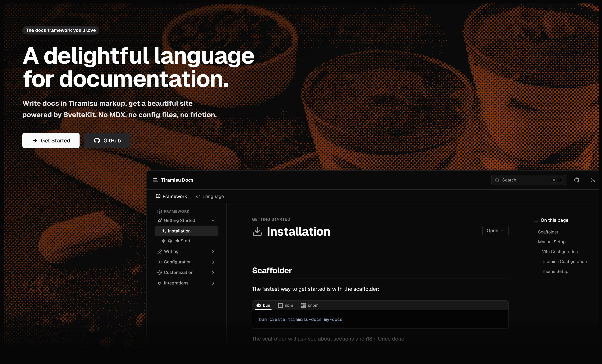

<p align="center">
  <a href="https://tiramisudocs.com">
    
  </a>
</p>

<h1 align="center">Tiramisu Docs</h1>

<p align="center">
  <a href="https://tiramisudocs.com">tiramisudocs.com</a>
</p>

A documentation framework built on [SvelteKit](https://svelte.dev/docs/kit) and the [Tiramisu](https://github.com/timeleaplabs/tiramisu) markup language. Write `.tiramisu` files, get a fully themed documentation site with search, i18n, SEO, and an MCP server for AI assistants.

## Packages

| Package | Description |
|---------|-------------|
| [`@tiramisu-docs/core`](packages/core) | Tiramisu-to-Svelte compiler and metadata extraction |
| [`@tiramisu-docs/kit`](packages/kit) | Vite plugin, layout components, theme, and SEO helpers |
| [`create-tiramisu-docs`](packages/create-tiramisu-docs) | CLI scaffolder for new projects |

The `playground/` directory is a reference documentation site that demonstrates all features.

## Quick Start

```bash
bun create tiramisu-docs my-docs
cd my-docs
bun dev
```

Write documentation in `src/docs/` using `.tiramisu` files. Pages are automatically routed and added to the sidebar.

## Development

This is a [Bun](https://bun.sh) workspace monorepo.

```bash
# Install dependencies
bun install

# Build all packages
bun run build

# Run all tests
bun test

# Run the playground dev server
cd playground && bun dev
```

### Workspace Structure

```
tiramisu-docs/
├── packages/
│   ├── core/           # Compiler & meta extraction
│   ├── kit/            # Vite plugin, components, theme
│   └── create-tiramisu-docs/  # CLI scaffolder
├── playground/         # Reference docs site
└── docs/plans/         # Design & implementation docs
```

## How It Works

1. **Write** — Author pages in `.tiramisu` files with `meta { title = ... }` frontmatter
2. **Build** — The Vite plugin compiles `.tiramisu` to Svelte components and generates a virtual module with docs, search index, and sidebar
3. **Ship** — Deploy as any SvelteKit app (serverless, edge, Node.js, static)

## Tech Stack

- [SvelteKit 2](https://svelte.dev/docs/kit) + [Svelte 5](https://svelte.dev)
- [Tailwind CSS 4](https://tailwindcss.com) + [shadcn-svelte](https://www.shadcn-svelte.com)
- [Shiki](https://shiki.style) for syntax highlighting
- [MiniSearch](https://lucaong.github.io/minisearch/) for client-side search
- [KaTeX](https://katex.org) + [Mermaid](https://mermaid.js.org) for math and diagrams

## License

Apache 2.0
